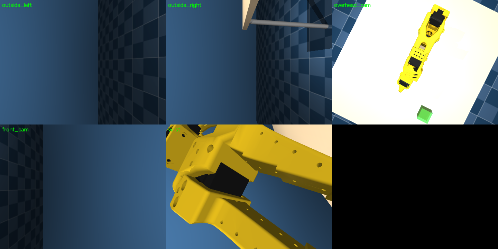
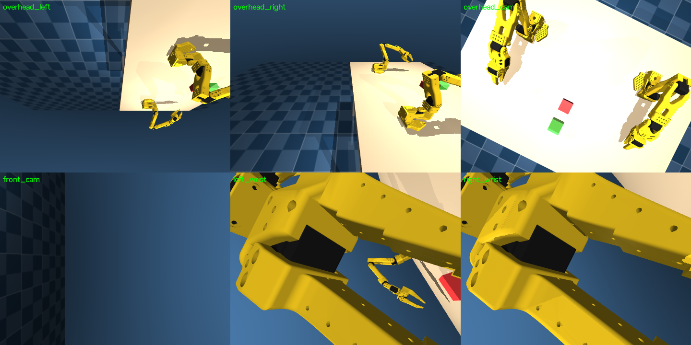
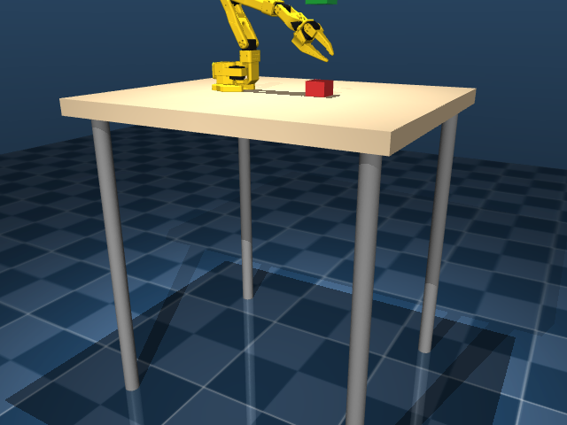
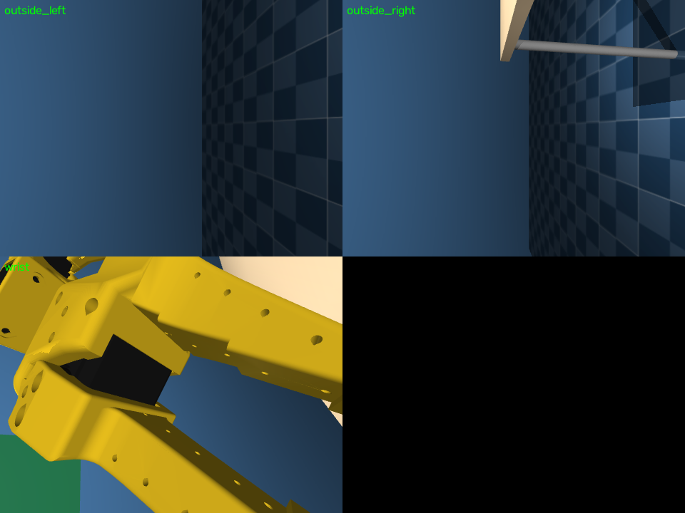
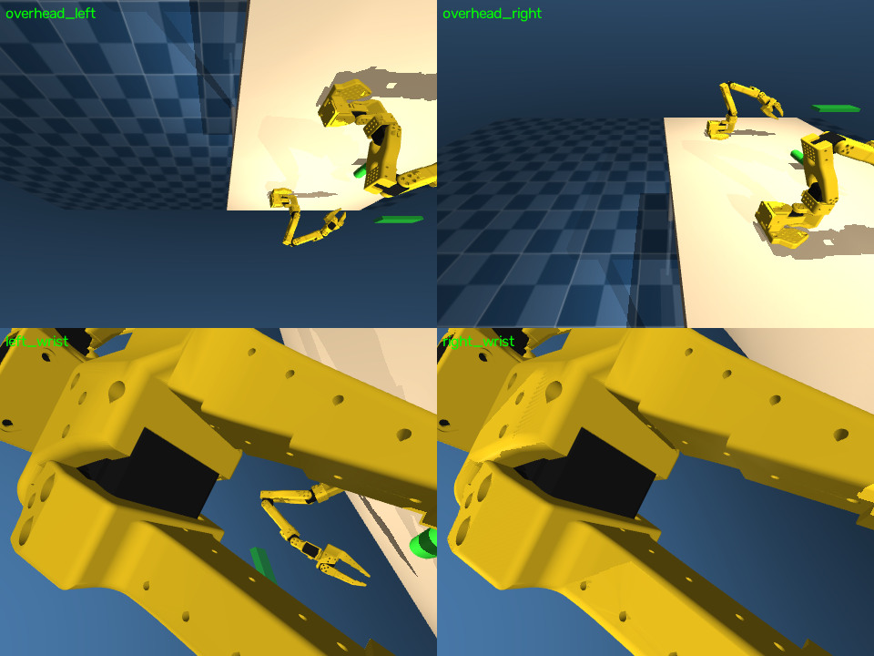
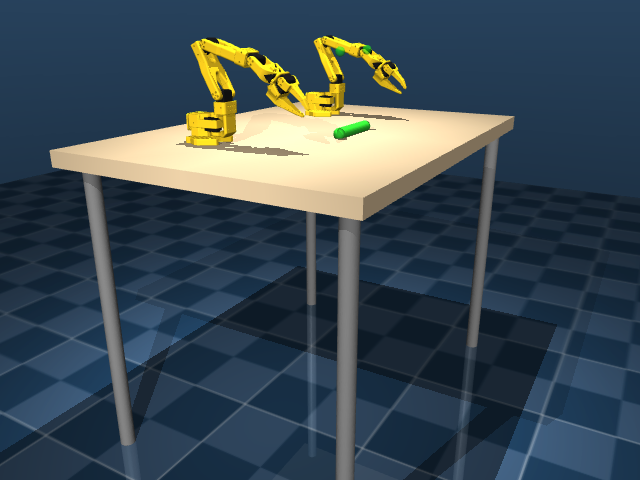

# SO-101 Environments

Six MuJoCo `gymnasium.Env` implementations built on the SO-101 follower arm
(6-DoF + gripper, STS3215 servos): two general data-collection envs
(single/dual arm, `push`/`pull`/`none` tasks) and four fixed-task envs
(pick-lift, pick-and-place, cylinder-grasp, cylinder-reach). All share robot
definitions from `robots/so101/` (see that dir's README for provenance).

Per-task MDP specs (rewards, obs/action spaces, termination, training) live
in each env's `MDP.md` — index at root [`MDP.md`](MDP.md). Isaac Lab ports
of the four task envs: [`envs/isaac/`](isaac/README.md).

All envs expose a full camera suite: per-arm wrist cams + global
`overhead_cam` (top-down) and `front_cam` (workspace view). Every camera's
pos/euler/fov is runtime-customizable via `CameraConfig` entries in each
`env.py`. Dual-arm geometry: follower bases 18 in (0.4572 m) apart in Y,
Z/X axes parallel (matches the real rig).

## Single arm — `envs/mujoco/so101_single_arm/`

One SO-101 arm at a table with a cube (task object) and a goal marker.


- **Joints/actuators (6):** `shoulder_pan`, `shoulder_lift`, `elbow_flex`, `wrist_flex`, `wrist_roll`, `gripper`
- **EE site:** `gripperframe`
- **Cameras (5):** `wrist` (gripper-mounted), `outside_left`, `outside_right`, `overhead_cam` (top-down), `front_cam`
- **Tasks:** `none` (data collection only), `push`, `pull`
- **Action space:** `(6,)` target joint positions, radians
- **Entry point:** `envs.mujoco.so101_single_arm.env.make_env(n_envs, use_async_envs, cfg)`

Camera streams tiled:



## Dual arm — `envs/mujoco/so101_dual_arm/`

Two SO-101 arms (`left_`/`right_` prefixed) facing each other across a wider
table, same cube/goal task.


- **Joints/actuators (12):** left/right × `{shoulder_pan, shoulder_lift, elbow_flex, wrist_flex, wrist_roll, gripper}`
- **EE sites:** `left_gripperframe`, `right_gripperframe`
- **Cameras (6):** `left_wrist`, `right_wrist`, `overhead_left`, `overhead_right`, `overhead_cam`, `front_cam`
- **Tasks:** `none`, `push`, `pull`
- **Action space:** `(12,)` = left 6 + right 6 target joint positions, radians
- **Entry point:** `envs.mujoco.so101_dual_arm.env.make_env(n_envs, use_async_envs, cfg)`

Camera streams tiled:



## Task envs

Four fixed-task envs built on the same robot/world pattern as the two envs
above, each with its own `assets/scene.xml` pointed at `robots/so101/` (no
duplicated meshes or robot XML). Reward, observation, and success-criteria
details are in each env's own README.

### Pick-lift — `envs/mujoco/so101_single_arm_pick_lift/`

Single SO-101 arm grasps a cube and lifts it above a height threshold.



- **Joints/actuators (6):** same as single arm above
- **EE site:** `gripperframe`
- **Cameras (3):** `wrist`, `outside_left`, `outside_right`
- **Action space:** `(6,)` target joint positions, radians
- **Entry point:** `envs.mujoco.so101_single_arm_pick_lift.env.make_env(n_envs, use_async_envs, cfg)`



### Pick-and-place — `envs/mujoco/so101_single_arm_pick_place/`

Single SO-101 arm grasps a cube and places it on a flat target disc.


- **Joints/actuators (6):** same as single arm above
- **EE site:** `gripperframe`
- **Cameras (3):** `wrist`, `outside_left`, `outside_right`
- **Action space:** `(6,)` target joint positions, radians
- **Entry point:** `envs.mujoco.so101_single_arm_pick_place.env.make_env(n_envs, use_async_envs, cfg)`


### Cylinder grasp — `envs/mujoco/so101_dual_arm_cylinder_grasp/`

Two SO-101 arms each grasp one end of a thin freely-moving cylinder and lift
it together above a height threshold.


- **Joints/actuators (12):** left/right × `{shoulder_pan, shoulder_lift, elbow_flex, wrist_flex, wrist_roll, gripper}`
- **EE sites:** `left_gripperframe`, `right_gripperframe`
- **Cameras (4):** `left_wrist`, `right_wrist`, `overhead_left`, `overhead_right`
- **Action space:** `(12,)` = left 6 + right 6 target joint positions, radians
- **Entry point:** `envs.mujoco.so101_dual_arm_cylinder_grasp.env.make_env(n_envs, use_async_envs, cfg)`



### Cylinder reach — `envs/mujoco/so101_dual_arm_cylinder_reach/`

Two SO-101 arms reach toward target points floating above the ends of a
static (fixed, non-physical) cylinder — no grasping, no lifting.



- **Joints/actuators (12):** left/right × `{shoulder_pan, shoulder_lift, elbow_flex, wrist_flex, wrist_roll, gripper}`
- **EE sites:** `left_gripperframe`, `right_gripperframe`
- **Cameras (4):** `left_wrist`, `right_wrist`, `overhead_left`, `overhead_right`
- **Action space:** `(12,)` = left 6 + right 6 target joint positions, radians
- **Entry point:** `envs.mujoco.so101_dual_arm_cylinder_reach.env.make_env(n_envs, use_async_envs, cfg)`


## Manually checking an environment

`scripts/verify_manual.py` is the go-to script for eyeballing an env before
trusting it — opens the interactive 3D viewer alongside a live tiled window
of every camera, so you can confirm robot geometry, camera framing, and
physics stability by hand.

```bash
conda activate so101
python scripts/verify_manual.py --env single     # interactive: 3D viewer + camera grid
python scripts/verify_manual.py --env dual
python scripts/verify_manual.py --env pick_lift
python scripts/verify_manual.py --env pick_place
python scripts/verify_manual.py --env cyl_grasp
python scripts/verify_manual.py --env cyl_reach
```

Controls: drag to orbit the 3D viewer, scroll to zoom. Press **ESC** in the
camera-grid window (or close either window) to exit. The robot starts at its
`home` keyframe pose and physics runs live (gravity, no control input), so
you'll see it sag/settle — that's expected with no actuator holding it,
useful for confirming joint limits and collision geometry look right.

For CI / non-interactive checks (no GUI, exits nonzero on failure):

```bash
python scripts/verify_manual.py --env single --headless-check
python scripts/verify_manual.py --env dual --headless-check
python scripts/verify_manual.py --env pick_lift --headless-check
python scripts/verify_manual.py --env pick_place --headless-check
python scripts/verify_manual.py --env cyl_grasp --headless-check
python scripts/verify_manual.py --env cyl_reach --headless-check
```

This compiles the scene, loads the keyframe, renders every camera and checks
none are blank, then resets/steps the env once. See also `verify_envs.py`
(repo root) for a more detailed per-env observation/action-space dump.

## Robot definitions

Shared meshes, MJCF kinematics, and URDFs live in `robots/so101/` — see
`robots/so101/README.md`.

## Teleop / data collection scripts

See `scripts/README.md` for gamepad IK teleop, real leader-arm teleop, and
the camera-viewer script.
