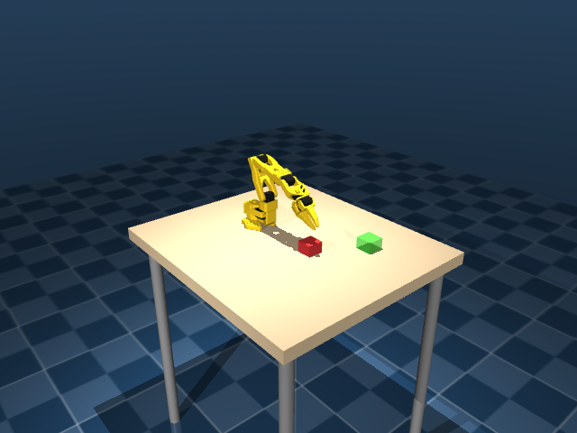
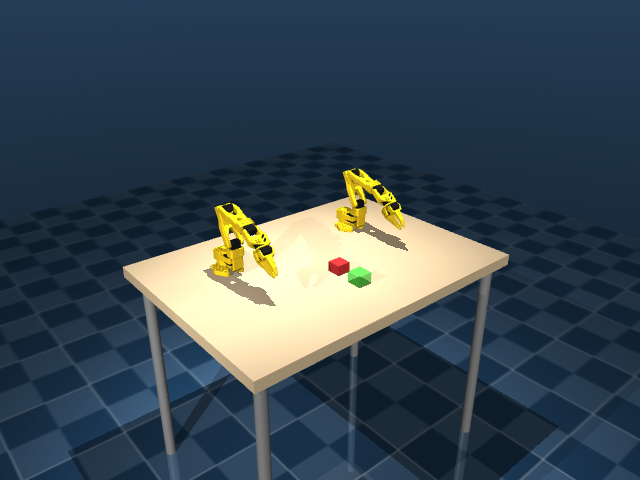

# SO-101 MNRI

MuJoCo simulation environments for the SO-101 robot arm (single-arm and
dual-arm), plus teleop and data-collection tooling. Conda env: `so101`.

```bash
conda activate so101
```

## Environments

| | Single arm | Dual arm |
|---|---|---|
| |  |  |
| Path | `envs/mujoco/so101_single_arm/` | `envs/mujoco/so101_dual_arm/` |
| Joints | 6 | 12 (2×6) |
| Cameras | 5 (wrist + 2 side + overhead + front) | 6 (2 wrist + 2 side + overhead + front) |

Four fixed-task envs built on the same robot/world pattern:

| | Path | Arms | Task |
|---|---|---|---|
| Pick-lift | `envs/mujoco/so101_single_arm_pick_lift/` | 1 | grasp cube, lift above threshold |
| Pick-and-place | `envs/mujoco/so101_single_arm_pick_place/` | 1 | grasp cube, place on target disc |
| Cylinder grasp | `envs/mujoco/so101_dual_arm_cylinder_grasp/` | 2 | grasp opposite ends of a free cylinder, lift together |
| Cylinder reach | `envs/mujoco/so101_dual_arm_cylinder_reach/` | 2 | reach target points above a static cylinder's ends |

Full details, camera lists, and observation/action spaces: **[ENVS.md](ENVS.md)**.

## Quick run

Look at an environment (interactive 3D view + live camera streams):

```bash
python scripts/verify_manual.py --env single
python scripts/verify_manual.py --env dual
```

Headless sanity check (CI-safe, exits nonzero on failure):

```bash
python scripts/verify_manual.py --env single --headless-check
python scripts/verify_manual.py --env pick_lift --headless-check   # and pick_place, cyl_grasp, cyl_reach
python verify_envs.py --env both
```

Tile every camera into one grid, save a PNG without opening a window:

```bash
python scripts/view_cameras.py --env single --save single_cams.png
```

Use in Python:

```python
from envs.mujoco.so101_single_arm.env import make_env, SingleArmEnvConfig

env = make_env(n_envs=1, cfg=SingleArmEnvConfig(task="push"))
obs, _ = env.reset()
obs, reward, terminated, truncated, info = env.step(action)
```

Set `MUJOCO_GL=egl` (or `osmesa`) for headless rendering on machines without
a display.

## Teleoperation

```bash
python scripts/teleop_gamepad_ik.py --env single         # gamepad -> Cartesian IK
python scripts/teleop_leader_arm.py --env single          # real SO-101 leader arm -> sim
```

Details, control mappings, and the `--dry-run` flags for hardware-free
testing: **[scripts/README.md](scripts/README.md)**.

`teleop_gamepad_ik.py`'s `IKTeleop` class is the integration point for
upcoming [mujoco-ar-viewer](https://github.com/Improbable-AI/mujoco-ar-viewer)
AR-driven teleop/data collection — the IK/physics loop doesn't change, only
the source of `set_ee_target()` calls.

## Robot definitions

Meshes, MJCF kinematics, and URDFs are canonical under `robots/so101/`
(shared by both envs, not duplicated) — see `robots/so101/README.md`.

## Repo layout

```
envs/
  mujoco/
    so101_single_arm/              single-arm env (env.py, assets/scene.xml)
    so101_dual_arm/                dual-arm env
    so101_single_arm_pick_lift/    single-arm: grasp + lift cube
    so101_single_arm_pick_place/   single-arm: grasp cube, place on target
    so101_dual_arm_cylinder_grasp/ dual-arm: grasp + lift cylinder together
    so101_dual_arm_cylinder_reach/ dual-arm: reach cylinder-end targets
  isaac/                (planned) Isaac Lab port
robots/so101/            shared meshes, MJCF, URDF — single source of truth
scripts/                 teleop, camera viewer, manual verification
images/                  screenshots used in this README / ENVS.md
```

## Working with other agents

If you're an agent picking up follow-on work in this repo, start at
**[AGENT_TASKS.md](AGENT_TASKS.md)** — open tasks, validation steps, and
constraints (e.g. don't duplicate meshes outside `robots/so101/`).
