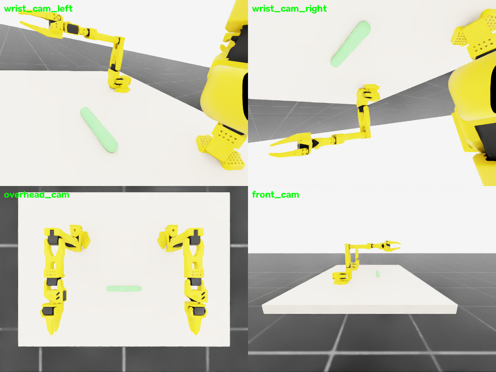

# MDP spec — SO101-CylGrasp-Dual-v0 (Isaac Lab)

Dual-arm cooperative cylinder grasp-and-lift. **Two follower instances of the
same USD**: `LeftArm` at (0.18, **+0.2286**, 0.82), `RightArm` at
(0.18, **−0.2286**, 0.82) — bases 18 in (0.4572 m) apart in Y, Z and X axes
parallel (identity orientation), exactly the real rig. Thin free cylinder
(r 1.5 cm, length 15 cm, 50 g) at (0.45, 0, 0.83), ends at ±7.5 cm along its
local Y.

## Registration

```python
gym.make("SO101-CylGrasp-Dual-v0")
gym.make("SO101-CylGrasp-Dual-Play-v0")
```

## Observation space (policy)

`left jp(6) + left jv(6) + right jp(6) + right jv(6) + cylinder_pose(7, left
root frame) + cylinder_ends(6) + last_action(12)` = **(49,)**. Cameras:
`wrist_cam_left`, `wrist_cam_right` (on each gripper) + global `overhead_cam`,
`front_cam`.

## Action space

`(12,)` = left 6 + right 6 absolute joint targets, rad.

## Reward terms

| Term | Weight | Formula |
|---|---|---|
| `reach_left` | 1.0 | `1 − tanh(‖ee_L − end_a‖ / 0.1)` |
| `reach_right` | 1.0 | `1 − tanh(‖ee_R − end_b‖ / 0.1)` |
| `grasp_left` | 2.5 | `1[‖ee_L − end_a‖ < 0.035]` |
| `grasp_right` | 2.5 | `1[‖ee_R − end_b‖ < 0.035]` |
| `lift_progress` | 1.5 | `1[a∧b grasped] · clamp((cyl_z − init_z)/0.05, 0, 3)` |
| `action_rate` | −0.01 | `‖a_t − a_{t−1}‖²` |
| `alive` | **−0.05** | per-step, dominant over action_rate |
| `success_bonus` | 10.0 | success condition |

## Termination

- `terminated`: both ends grasped AND `Δh > 0.05`
- `truncated`: 1000-step timeout

## Domain randomization

| Term | Mode | Range |
|---|---|---|
| `reset_cylinder_position` | reset | X ± 4 cm only (Y stays centred between arms) |
| `randomize_cylinder_mass` | startup | 0.05–0.25 kg |

## Training

```bash
python -m rl.train --backend isaaclab --task SO101-CylGrasp-Dual-v0 --algo skrl   --num-envs 2048
python -m rl.train --backend isaaclab --task SO101-CylGrasp-Dual-v0 --algo rsl_rl --num-envs 2048
```

Same shared PPO config (see `rl/agents/`).


*Isaac Lab RTX renders: `wrist_cam_left` / `wrist_cam_right` (each aimed at
the cylinder from its gripper), `overhead_cam` (both arms + cylinder, 18 in
spacing), `front_cam`. Regenerate with
`python -m envs.isaac.scripts.render_cameras`.*
