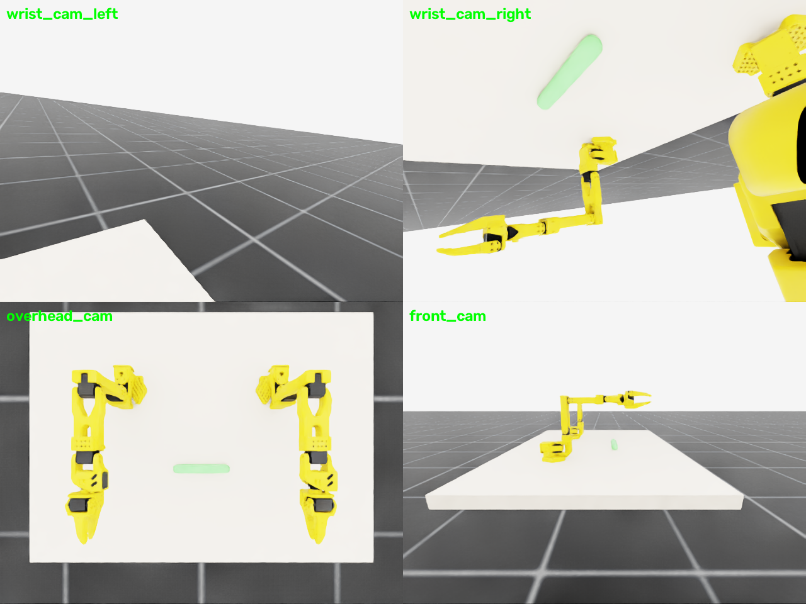

# MDP spec — SO101-CylReach-Dual-v0 (Isaac Lab)

Dual-arm reach task. The cylinder is a **kinematic** (fixed) body between the
arms; each arm's TCP must reach a point **5 cm above** its cylinder end and
hold it. No grasping.

Change vs the MuJoCo env (deliberate, per `MJLAB_INTEGRATION.md`): success
tolerance tightened 3.5 cm → **1 cm**, held `hold_steps = 10` consecutive
steps. Validate reachability during training.

## Registration

```python
gym.make("SO101-CylReach-Dual-v0")
gym.make("SO101-CylReach-Dual-Play-v0")
```

## Observation space (policy)

`left jp(6) + left jv(6) + right jp(6) + right jv(6) + cylinder_ends(6, left
root frame) + last_action(12)` = **(42,)**. Targets are not obs terms — they
derive deterministically from the (observed) cylinder ends + fixed z-offset.
Cameras: per-arm wrist + global overhead/front.

## Action space

`(12,)` = left 6 + right 6 absolute joint targets, rad.

## Reward terms

| Term | Weight | Formula |
|---|---|---|
| `reach_left` | 1.5 | `1 − tanh(‖ee_L − (end_a + ẑ·0.05)‖ / 0.05)` |
| `reach_right` | 1.5 | `1 − tanh(‖ee_R − (end_b + ẑ·0.05)‖ / 0.05)` |
| `hold_bonus` | 2.0 | `1[both TCPs within 1 cm, this step]` |
| `action_rate` | −0.01 | `‖a_t − a_{t−1}‖²` |
| `alive` | **−0.05** | per-step, dominant over action_rate |
| `success_bonus` | 10.0 | hold counter ≥ 10 |

## Termination

- `terminated`: both TCPs within 1 cm of targets for 10 consecutive steps
- `truncated`: 1000-step timeout

## Domain randomization

| Term | Mode | Range |
|---|---|---|
| `reset_cylinder_position` | reset | X ± 5 cm (kinematic body teleported at reset; targets follow automatically) |

No mass DR — fixed body, mass irrelevant to reach.

## Training

```bash
python -m rl.train --backend isaaclab --task SO101-CylReach-Dual-v0 --algo skrl   --num-envs 2048
python -m rl.train --backend isaaclab --task SO101-CylReach-Dual-v0 --algo rsl_rl --num-envs 2048
```

Same shared PPO config (see `rl/agents/`).


*Isaac Lab RTX renders: per-arm wrist cams aimed at the cylinder ends,
`overhead_cam`, `front_cam`. Regenerate with
`python -m envs.isaac.scripts.render_cameras`.*
