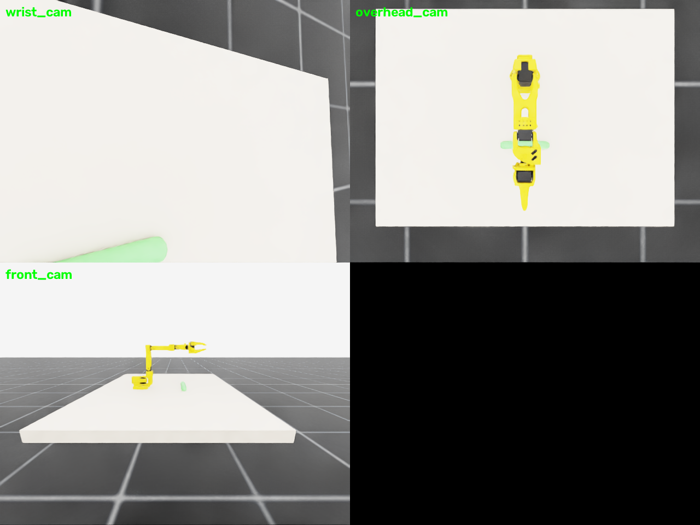

# MDP spec — SO101-CylReach-Single-v0 (Isaac Lab)

Single-arm reach task (sibling of `SO101-CylReach-Dual-v0`, no MuJoCo twin).
A thin cylinder is a **kinematic** (fixed) body in front of the arm; the
gripper TCP must reach a point **5 cm above** the cylinder's **`b` end**
(local +Y side) and hold it. No grasping.

Same deliberate tolerance tightening as the dual task: success threshold
**1 cm** (vs MuJoCo envs' 3.5 cm), held `hold_steps = 10` consecutive steps.

## Registration

```python
gym.make("SO101-CylReach-Single-v0")
gym.make("SO101-CylReach-Single-Play-v0")
```

## Observation space (policy)

`jp(6) + jv(6) + cylinder_ends(6, robot root frame) + last_action(6)` =
**(24,)**. Targets are not obs terms — they derive deterministically from the
(observed) cylinder ends + fixed z-offset.
Cameras: wrist + global overhead/front.

## Action space

`(6,)` absolute joint targets, rad.

## Reward terms

| Term | Weight | Formula |
|---|---|---|
| `reach_end` | 1.5 | `1 − tanh(‖ee − (end_b + ẑ·0.05)‖ / 0.05)` |
| `hold_bonus` | 2.0 | `1[TCP within 1 cm for ≥10 consecutive steps]` |
| `action_rate` | −0.01 | `‖a_t − a_{t−1}‖²` |
| `alive` | **−0.05** | per-step, dominant over action_rate |
| `success_bonus` | 10.0 | hold counter ≥ 10 |

## Termination

- `terminated`: TCP within 1 cm of the target for 10 consecutive steps
- `truncated`: 1000-step timeout

## Domain randomization

| Term | Mode | Range |
|---|---|---|
| `reset_cylinder_position` | reset | X ± 5 cm (kinematic body teleported at reset; target follows automatically) |

No mass DR — fixed body, mass irrelevant to reach.

## Training

```bash
python -m rl.train --backend isaaclab --task SO101-CylReach-Single-v0 --algo skrl   --num-envs 4096
python -m rl.train --backend isaaclab --task SO101-CylReach-Single-v0 --algo rsl_rl --num-envs 4096
```

Same shared PPO config (see `rl/agents/`).

## Camera views


