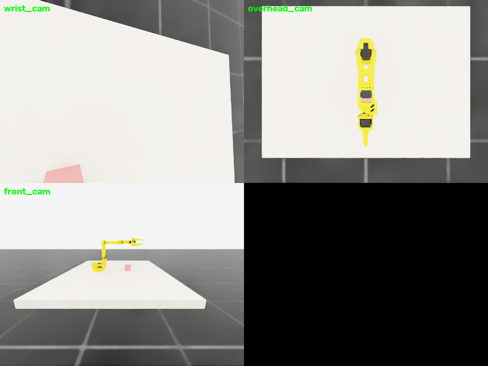

# MDP spec — SO101-PickLift-Single-v0 (Isaac Lab)

Single-arm pick-lift on Isaac Sim 6.0.1 / Isaac Lab 3.0.0b2. Twin of the
MuJoCo env — same scene, geometry (table 0.82 m, cube at (0.45, 0, 0.845)),
camera suite, and task logic.


*Isaac Lab RTX renders at the home pose: `wrist_cam` (on `gripper_frame_link`,
aimed at the cube), `overhead_cam` (top-down, whole workspace), `front_cam`
(front view, whole workspace). All poses are cfg fields — see
`envs/isaac/tasks/common.py`; regenerate with
`python -m envs.isaac.scripts.render_cameras`.*

## Registration

```python
gym.make("SO101-PickLift-Single-v0")          # training (4096 envs default)
gym.make("SO101-PickLift-Single-Play-v0")     # eval (50 envs, no obs noise)
```

- Robot: `envs/isaac/assets/so101/so101.usda` (from `robots/so101/so101.urdf`,
  fixed base, `gripper_frame_link` preserved as TCP body)
- Actuators: implicit PD (stiffness 100, damping 2.5, effort ±3.35 N·m —
  STS3215 servo model)
- Control: 50 Hz (decimation 4 × dt 0.005), episodes 20 s = 1000 steps

## Observation space (policy group, state)

| Term | Shape | Source |
|---|---|---|
| `joint_pos` | (6,) | `joint_pos_rel` (pos − default) |
| `joint_vel` | (6,) | `joint_vel_rel` |
| `object_position` | (3,) | cube position in robot root frame |
| `actions` | (6,) | last action |

Total **(21,)**. Cameras (`wrist`, `overhead_cam`, `front_cam`) render
separately via `env.scene["<name>"].data.output["rgb"]` — not concatenated
into the policy vector. All camera poses are cfg fields (`tasks/common.py`
defaults).

## Action space

`(6,)` — absolute joint position targets, rad (`use_default_offset=False`,
`preserve_order=True`), clipped to joint limits.

## Reward terms

| Term | Weight | Formula |
|---|---|---|
| `reach_object` | 1.0 | `1 − tanh(‖ee − cube‖ / 0.1)` |
| `grasp_bonus` | 2.5 | `1[‖ee − cube‖ < 0.035]` |
| `lift_progress` | 1.5 | `1[grasped] · clamp((cube_z − init_z)/0.05, 0, 3)` |
| `action_rate` | −0.01 | `‖a_t − a_{t−1}‖²` |
| `alive` | **−0.05** | −1 per step while episode runs (dominant over action_rate → no stalling) |
| `success_bonus` | 10.0 | success condition |

## Termination

- `terminated`: grasped AND `Δh > 0.05` (success)
- `truncated`: 1000-step timeout

## Domain randomization

| Term | Mode | Range |
|---|---|---|
| `reset_object_position` | reset | cube XY ± 6 cm |
| `randomize_object_mass` | startup | 0.08–0.35 kg, inertia recomputed |
| obs corruption | always | default noise on policy obs (off in `_PLAY`) |

## Training

```bash
python -m rl.train --backend isaaclab --task SO101-PickLift-Single-v0 --algo skrl   --num-envs 4096
python -m rl.train --backend isaaclab --task SO101-PickLift-Single-v0 --algo rsl_rl --num-envs 4096 --no-wandb
```

PPO (shared config, `rl/agents/`): MLP [256,128,64] ELU actor+critic;
rollouts 24; epochs 5; minibatches 4; lr 1e-3 adaptive KL 0.01; γ 0.99;
λ 0.95; clip 0.2; entropy 0; 1500 iterations default; checkpoints every 100.
