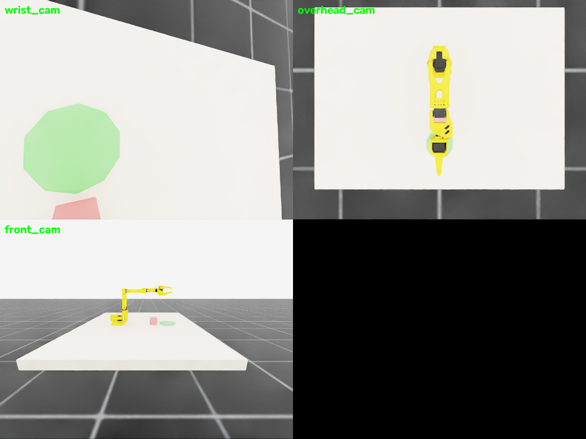

# MDP spec — SO101-PickPlace-Single-v0 (Isaac Lab)

Single-arm pick-and-place on Isaac Sim 6.0.1 / Isaac Lab 3.0.0b2. Twin of
`envs/mujoco/so101_single_arm_pick_place/`. Cube at (0.45, 0, 0.845); target
disc at (0.55, 0, 0.83).


*Isaac Lab RTX renders at the home pose (`wrist_cam`, `overhead_cam`,
`front_cam`). Regenerate with `python -m envs.isaac.scripts.render_cameras`.*

## Registration

```python
gym.make("SO101-PickPlace-Single-v0")
gym.make("SO101-PickPlace-Single-Play-v0")
```

## Observation space (policy)

`joint_pos_rel(6) + joint_vel_rel(6) + object_pose(7, pos+quat in root frame)
+ last_action(6)` = **(25,)**. Cameras render separately (wrist + overhead +
front).

## Action space

`(6,)` absolute joint targets, rad.

## Reward terms

| Term | Weight | Formula |
|---|---|---|
| `reach_object` | 1.0 | `1 − tanh(‖ee − cube‖ / 0.1)` |
| `grasp_bonus` | 2.5 | `1[‖ee − cube‖ < 0.035]` |
| `place_progress` | 1.5 | `1[grasped] · (1 − tanh(‖cube_xy − target_xy‖ / 0.1))` |
| `action_rate` | −0.01 | `‖a_t − a_{t−1}‖²` |
| `alive` | **−0.05** | per-step penalty, dominant over action_rate |
| `success_bonus` | 10.0 | success condition |

## Termination

- `terminated`: cube within **1 cm** XY of target, tilt **< 10°**, released
  (ee > 5 cm away), near-static (< 0.05 m/s)
- `truncated`: 1000-step timeout

## Domain randomization

| Term | Mode | Range |
|---|---|---|
| `reset_object_position` | reset | cube XY ± 5 cm |
| `randomize_object_mass` | startup | 0.08–0.35 kg |

## Training

```bash
python -m rl.train --backend isaaclab --task SO101-PickPlace-Single-v0 --algo skrl   --num-envs 4096
python -m rl.train --backend isaaclab --task SO101-PickPlace-Single-v0 --algo rsl_rl --num-envs 4096
```

Same shared PPO config as pick-lift (see `rl/agents/`).
