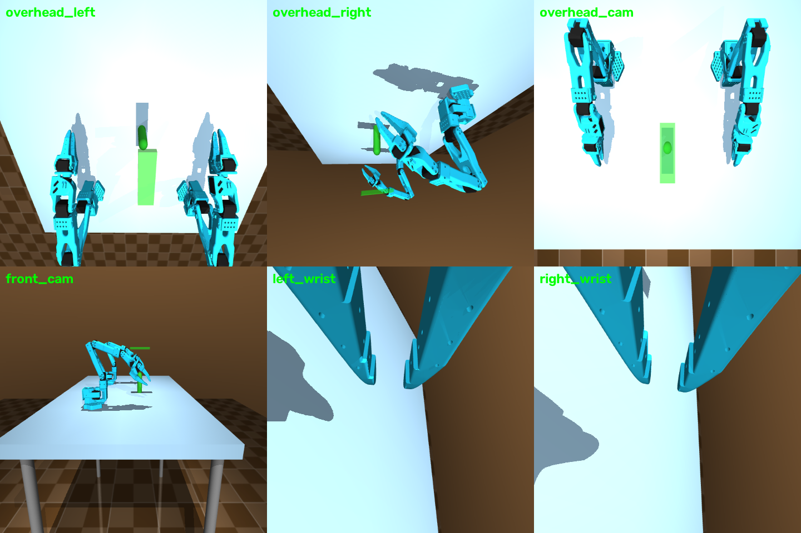

# MDP spec — Cylinder grasp (dual arm)

Two SO-101 follower arms — bases **18 in (0.4572 m) apart in Y, Z and X axes
parallel**, matching the real rig — cooperatively grasp opposite ends of a
thin free cylinder (r = 1.5 cm, length 15 cm, 50 g) and lift it together
**5 cm** above its initial height. MuJoCo:
`envs/mujoco/so101_dual_arm_cylinder_grasp/`; Isaac Lab:
`SO101-CylGrasp-Dual-v0`.


*All cameras rendered from the live env (top: `overhead_left`,
`overhead_right`, `overhead_cam`; bottom: `front_cam`, `left_wrist`,
`right_wrist`). The global `overhead_cam`/`front_cam` cover the entire
workspace; every pose is customizable via `CameraConfig`.*

## Observation space

| Field | Shape | Dtype | Description |
|---|---|---|---|
| `left_joint_pos` / `right_joint_pos` | (6,) each | float32 | absolute joint positions, rad |
| `left_joint_vel` / `right_joint_vel` | (6,) each | float32 | joint velocities, rad/s |
| `left_ee_pos` / `right_ee_pos` | (3,) each | float32 | TCP world positions, m |
| `cyl_pos` | (3,) | float32 | cylinder centre world position, m |
| `cyl_quat` | (4,) | float32 | cylinder orientation, wxyz |
| `cyl_end_a_pos` / `cyl_end_b_pos` | (3,) each | float32 | cylinder end-site world positions (a = left arm's end) |
| `left_is_grasped` / `right_is_grasped` | (1,) each | float32 | per-arm grasp flags |
| `images` | dict | uint8 | `{cam_name: (H, W, 3)}` |

Isaac Lab policy obs: `12 jp + 12 jv + cyl_pose(7) + cyl_ends(6) +
last_action(12)` = **(49,)**.

## Action space

`(12,)` float32 = left 6 + right 6 absolute joint targets, rad.

## Reward terms

```
r = -(d_a + d_b) + 1[grasp_a] + 1[grasp_b]
    + 3 · min(max(0, Δh)/h_lift, 1) · 1[grasp_a ∧ grasp_b] + 10·1[success]
```

| Term | Weight | Formula | Gating |
|---|---|---|---|
| reach (per arm) | −1.0 × d | `d_a = ‖left_ee − end_a‖`, `d_b = ‖right_ee − end_b‖` | — |
| grasp bonus (per arm) | +1.0 | TCP-to-end dist < 3.5 cm and jaws closed | — |
| lift progress | ×3.0 | `min(Δh/0.05, 1)`, `Δh = cyl_z − init_z` | only while **both** ends grasped |
| success bonus | +10.0 | success below | — |

Isaac Lab adds: `alive = −0.05`/step, `action_rate = −0.01`, per-arm tanh
reach `1 − tanh(d/0.1)`.

## Termination

| Path | Condition |
|---|---|
| `terminated` (success) | both ends grasped AND `Δh > 0.05` m |
| `truncated` (timeout) | 34 s (1020 steps @ 30 Hz) |

## Domain randomization (Isaac Lab / mjlab training)

| What | Range | Mode |
|---|---|---|
| cylinder X spawn | ±4 cm (Y stays centred between arms) | reset |
| cylinder mass | 0.05–0.25 kg | startup |

## Training

```bash
python -m rl.train --backend isaaclab --task SO101-CylGrasp-Dual-v0 --algo skrl   --num-envs 2048
python -m rl.train --backend isaaclab --task SO101-CylGrasp-Dual-v0 --algo rsl_rl --num-envs 2048
python -m rl.train --backend mujoco --task cyl_grasp --algo skrl --max-iterations 200
```

Shared PPO hyperparameters: actor/critic MLP `[256, 128, 64]` ELU; rollouts
24; epochs 5; minibatches 4; lr 1e-3 adaptive (KL 0.01); γ 0.99; λ 0.95;
clip 0.2; entropy 0.
