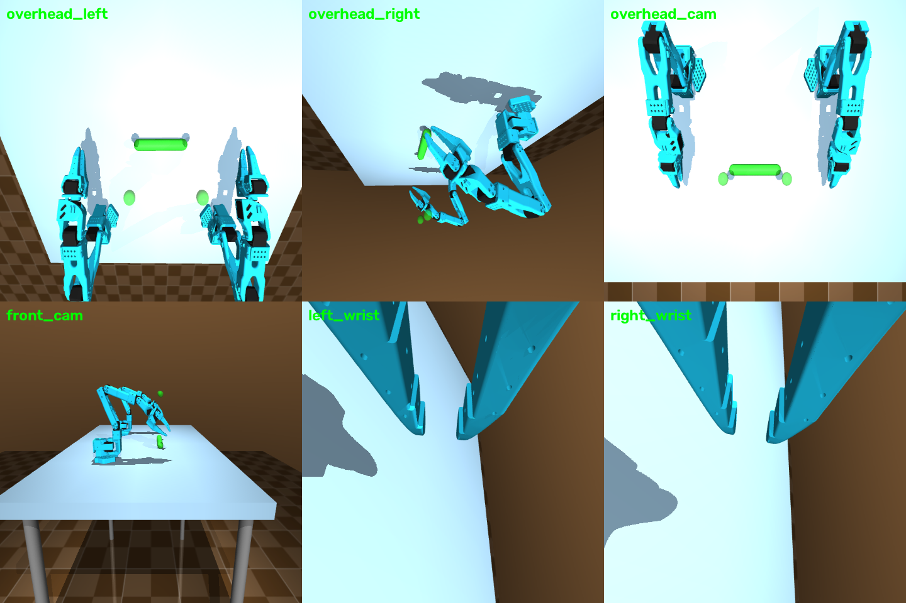

# MDP spec — Cylinder reach (dual arm)

Two SO-101 follower arms (bases 18 in apart, parallel Z/X axes) reach toward
target points floating **5 cm above** the ends of a thin cylinder that is
FIXED between them (no freejoint — pure reach, no grasping). MuJoCo:
`envs/mujoco/so101_dual_arm_cylinder_reach/`; Isaac Lab:
`SO101-CylReach-Dual-v0`.


*All cameras rendered from the live env (top: `overhead_left`,
`overhead_right`, `overhead_cam`; bottom: `front_cam`, `left_wrist`,
`right_wrist`).*

## Observation space

| Field | Shape | Dtype | Description |
|---|---|---|---|
| `left_joint_pos` / `right_joint_pos` | (6,) each | float32 | absolute joint positions, rad |
| `left_joint_vel` / `right_joint_vel` | (6,) each | float32 | joint velocities, rad/s |
| `left_ee_pos` / `right_ee_pos` | (3,) each | float32 | TCP world positions, m |
| `cyl_end_a_pos` / `cyl_end_b_pos` | (3,) each | float32 | fixed cylinder end positions (targets derive from these + z-offset) |
| `target_left` / `target_right` | (3,) each | float32 | target points above the ends |
| `images` | dict | uint8 | `{cam_name: (H, W, 3)}` |

Isaac Lab policy obs: `12 jp + 12 jv + cyl_ends(6) + last_action(12)` =
**(42,)**.

## Action space

`(12,)` float32 = left 6 + right 6 absolute joint targets, rad.

## Reward terms

```
r = -(d_L + d_R) + 2.0·1[both within pos_threshold] + 10·1[held hold_steps]
```

| Term | Weight | Formula | Gating |
|---|---|---|---|
| reach (per arm) | −1.0 × d | `d_L = ‖left_ee − target_L‖`, `d_R = ‖right_ee − target_R‖`; `target_i = end_i + (0,0,0.05)` | — |
| hold bonus | +2.0 | both TCPs within 3.5 cm (MuJoCo) / 1 cm (Isaac Lab) of targets | per-step |
| success bonus | +10.0 | hold condition sustained | — |

Isaac Lab adds: `alive = −0.05`/step, `action_rate = −0.01`, per-arm tanh
reach `1 − tanh(d/0.05)`. **Deliberate change vs MuJoCo**: success tolerance
tightened 3.5 cm → **1 cm** (per `MJLAB_INTEGRATION.md`), held for
`hold_steps = 10` consecutive steps.

## Termination

| Path | Condition |
|---|---|
| `terminated` (success) | hold counter ≥ `hold_steps` (10) |
| `truncated` (timeout) | 34 s (1020 steps @ 30 Hz) |

## Domain randomization (Isaac Lab)

| What | Range | Mode |
|---|---|---|
| cylinder X position | ±5 cm | reset (targets follow automatically — they derive from the cylinder ends each step) |

No mass DR — the cylinder is a fixed body; mass is irrelevant to reach.

## Training

```bash
python -m rl.train --backend isaaclab --task SO101-CylReach-Dual-v0 --algo skrl   --num-envs 2048
python -m rl.train --backend isaaclab --task SO101-CylReach-Dual-v0 --algo rsl_rl --num-envs 2048
python -m rl.train --backend mujoco --task cyl_reach --algo skrl --max-iterations 200
```

Shared PPO hyperparameters: actor/critic MLP `[256, 128, 64]` ELU; rollouts
24; epochs 5; minibatches 4; lr 1e-3 adaptive (KL 0.01); γ 0.99; λ 0.95;
clip 0.2; entropy 0.
