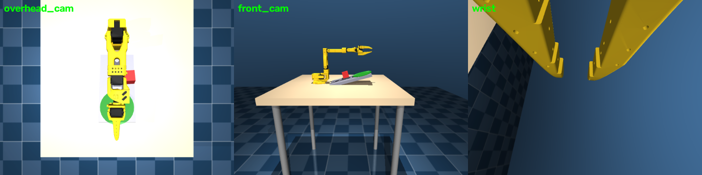

# SO-101 Single Arm Cube-Push-Ramp MuJoCo Environment

LeRobot EnvHub-compatible simulation environment for the SO-101 follower arm.
Task: push a 4.5 cm red cube **up a 15° ramp** into a green goal patch using
the closed gripper as a non-prehensile pusher. Friction is tuned so gravity
pulls the cube back down when pushing stops.

Two observation modes via `CubePushRampEnvConfig(obs_mode=...)`:
- `"full"` — cube pose visible (MDP), policy vector 24
- `"belief"` — cube pose hidden; known initial pose + 5-step proprioception/action history (POMDP proxy), policy vector 114

## Setup

```bash
pip install -r requirements.txt
```

## Usage

```python
from envs.mujoco.so101_single_arm_cube_push_ramp.env import make_env, CubePushRampEnvConfig

env = make_env(n_envs=1)
obs, _ = env.reset()
obs, reward, terminated, truncated, info = env.step(action)
```

## Cameras

| Camera | Frame | Description |
|--------|-------|-------------|
| `wrist` | gripper body | Mounted on SO-101 gripper |
| `overhead_cam` | world | Top-down view of the ramp |
| `front_cam` | world | Front view of the workspace |

Every camera's pos/euler/fov is customizable via `CameraConfig` in `env.py`.

## Observations (full mode)

```
joint_pos    (6,)        joint positions [rad]
joint_vel    (6,)        joint velocities [rad/s]
cube_pos     (3,)        cube position, robot root frame [m]
cube_yaw     (1,)        cube yaw, robot root frame [rad]
goal_pos     (2,)        goal patch xy, robot root frame [m]
last_action  (6,)        previous action
images.*                 {cam: (H,W,3) uint8}
```

Belief mode replaces `cube_pos`/`cube_yaw` with `cube_init_pos (3,)`,
`cube_init_yaw (1,)`, and `history (90,)`. See `MDP.md`.

## Actions

6D absolute joint position targets, radians, clipped to joint limits.
Close the gripper (~1.75 rad) to use it as a pusher.

## Reward

Dense tanh-kernel proximity to the goal + action-rate penalty + alive penalty
+ success bonus. Success: cube centre within 1 cm of the goal centre (planar).
Full table and provenance in `MDP.md`.

## Robot definitions

Shared meshes/MJCF live in `robots/so101/` — see `robots/so101/README.md`.

## Renders



