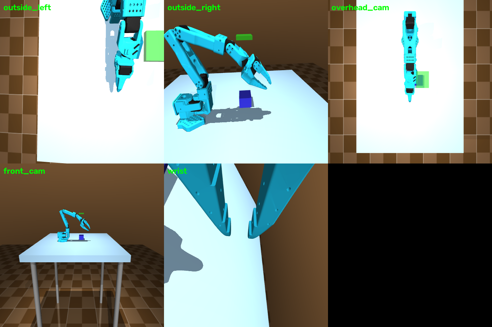

# MDP spec — Pick-lift (single arm)

One SO-101 follower arm grasps a 5 cm cube and lifts it **5 cm** above its
initial height. Same task definition in both sim backends — MuJoCo
(`envs/mujoco/so101_single_arm_pick_lift/`) and Isaac Lab
(`SO101-PickLift-Single-v0`).


*All cameras rendered from the live env (top: `outside_left`, `outside_right`,
`overhead_cam`; bottom: `front_cam`, `wrist`). Every camera's pos/euler/fov is
customizable via `CameraConfig` in `env.py` (MuJoCo) or the scene cfg
(Isaac Lab).*

## Observation space

| Field | Shape | Dtype | Description |
|---|---|---|---|
| `joint_pos` | (6,) | float32 | absolute joint positions, rad (`shoulder_pan, shoulder_lift, elbow_flex, wrist_flex, wrist_roll, gripper`) |
| `joint_vel` | (6,) | float32 | joint velocities, rad/s |
| `tcp_pos` | (3,) | float32 | gripper TCP (`gripperframe` site) world position, m |
| `tcp_quat` | (4,) | float32 | TCP orientation, wxyz |
| `is_grasped` | (1,) | float32 | 1.0 while gripper holds the cube |
| `obj_pos` | (3,) | float32 | cube world position, m |
| `obj_quat` | (4,) | float32 | cube orientation, wxyz |
| `tcp_to_obj` | (3,) | float32 | vector TCP → cube centre, m |
| `images` | dict | uint8 | `{cam_name: (H, W, 3)}` RGB from every camera |

Isaac Lab policy obs (state only, cameras are separate sensors):
`joint_pos_rel(6) + joint_vel_rel(6) + object_position(3) + last_action(6)` = **(21,)**.

## Action space

`(6,)` float32 — **absolute** target joint positions in radians, clipped to
the actuator `ctrlrange`. Position servos (STS3215 model), 30 Hz control
(MuJoCo) / 50 Hz (Isaac Lab).

## Reward terms

Total reward:

```
r = -d_reach + 1[grasped] + 3 · min(max(0, Δh)/h_lift, 1) · 1[grasped] + 10·1[success]
```

| Term | Weight | Formula | Gating |
|---|---|---|---|
| reach | −1.0 × d | `d = ‖tcp_pos − obj_pos‖` | — |
| grasp bonus | +1.0 | binary, gripper-cube dist < 3.5 cm **and** jaws closed | — |
| lift progress | ×3.0 | `min(Δh / 0.05, 1)`, `Δh = obj_z − init_obj_z` | only while grasped |
| success bonus | +10.0 | success condition below | — |

Isaac Lab adds the anti-reward-hacking terms (see `MJLAB_INTEGRATION.md`):
`alive = −0.05`/step (dominant over `action_rate = −0.01`), tanh-kernel reach
`1 − tanh(d/0.1)`, and the same staged bonuses.

## Termination

| Path | Condition |
|---|---|
| `terminated` (success) | grasped AND `Δh > 0.05` m |
| `truncated` (timeout) | 34 s episode (1020 steps @ 30 Hz) |

## Domain randomization (Isaac Lab / mjlab training)

| What | Range | Mode |
|---|---|---|
| cube XY spawn | ±6 cm | reset |
| cube mass | 0.08–0.35 kg (~1–4× nominal) | startup |

## Training

```bash
# Isaac Lab (GPU required)
python -m rl.train --backend isaaclab --task SO101-PickLift-Single-v0 --algo skrl   --num-envs 4096
python -m rl.train --backend isaaclab --task SO101-PickLift-Single-v0 --algo rsl_rl --num-envs 4096
# mjlab (MuJoCo Warp, GPU)
python -m rl.train --backend mjlab --task so101_pick_lift --algo skrl --num-envs 256
# plain MuJoCo (single env, CPU-friendly smoke)
python -m rl.train --backend mujoco --task pick_lift --algo skrl --max-iterations 200
```

Shared PPO hyperparameters (both skrl and rsl_rl): actor/critic MLP
`[256, 128, 64]` ELU; rollouts 24; epochs 5; minibatches 4; lr 1e-3 adaptive
(KL target 0.01); γ 0.99; λ 0.95; clip 0.2; entropy 0. TensorBoard logs under
`rl/runs/…`, WandB via `--wandb` (project `so101-rl`).
