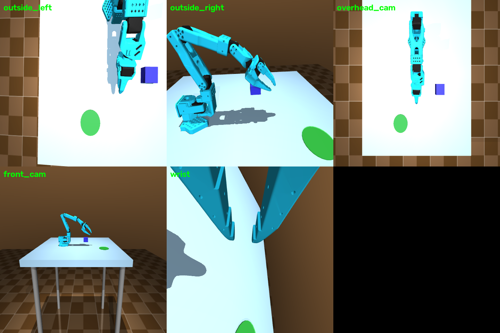

# MDP spec — Pick-and-place (single arm)

One SO-101 follower arm grasps a 5 cm cube and places it on the flat target
disc. MuJoCo: `envs/mujoco/so101_single_arm_pick_place/`; Isaac Lab:
`SO101-PickPlace-Single-v0`.


*All cameras rendered from the live env (top: `outside_left`, `outside_right`,
`overhead_cam`; bottom: `front_cam`, `wrist`). Poses customizable via
`CameraConfig`.*

## Observation space

| Field | Shape | Dtype | Description |
|---|---|---|---|
| `joint_pos` | (6,) | float32 | absolute joint positions, rad |
| `joint_vel` | (6,) | float32 | joint velocities, rad/s |
| `tcp_pos` | (3,) | float32 | gripper TCP world position, m |
| `tcp_quat` | (4,) | float32 | TCP orientation, wxyz |
| `is_grasped` | (1,) | float32 | 1.0 while gripper holds the cube |
| `obj_pos` | (3,) | float32 | cube world position, m |
| `obj_quat` | (4,) | float32 | cube orientation, wxyz |
| `tcp_to_obj` | (3,) | float32 | vector TCP → cube centre, m |
| `images` | dict | uint8 | `{cam_name: (H, W, 3)}` RGB from every camera |

Isaac Lab policy obs: `joint_pos_rel(6) + joint_vel_rel(6) + object_pose(7) +
last_action(6)` = **(25,)**.

## Action space

`(6,)` float32 — absolute target joint positions, rad.

## Reward terms

```
r = -d_reach + 1[grasped] - d_xy(obj, target)·1[grasped] + 10·1[success]
```

| Term | Weight | Formula | Gating |
|---|---|---|---|
| reach | −1.0 × d | `d = ‖tcp_pos − obj_pos‖` | — |
| grasp bonus | +1.0 | gripper-cube dist < 3.5 cm and jaws closed | — |
| place progress | −1.0 × d_xy | `d_xy = ‖obj_xy − target_xy‖` | only while grasped |
| success bonus | +10.0 | success condition below | — |

Isaac Lab adds: `alive = −0.05`/step, `action_rate = −0.01`, tanh-kernel
reach `1 − tanh(d/0.1)`, place progress `1 − tanh(d_xy/0.1)` gated on grasp.

## Termination

| Path | Condition |
|---|---|
| `terminated` (success) | cube on target (`d_xy < goal_thresh`), **released**, near-static. Isaac Lab tightens this to the 1 cm / 10°-tilt tolerance from `MJLAB_INTEGRATION.md` |
| `truncated` (timeout) | 34 s (1020 steps @ 30 Hz) |

## Domain randomization (Isaac Lab / mjlab training)

| What | Range | Mode |
|---|---|---|
| cube XY spawn | ±5 cm | reset |
| target XY spawn | ±5 cm | reset (Isaac Lab: target disc is fixed; DR on the roadmap) |
| cube mass | 0.08–0.35 kg | startup |

## Training

```bash
python -m rl.train --backend isaaclab --task SO101-PickPlace-Single-v0 --algo skrl   --num-envs 4096
python -m rl.train --backend isaaclab --task SO101-PickPlace-Single-v0 --algo rsl_rl --num-envs 4096
python -m rl.train --backend mujoco --task pick_place --algo skrl --max-iterations 200
```

Shared PPO hyperparameters: actor/critic MLP `[256, 128, 64]` ELU; rollouts
24; epochs 5; minibatches 4; lr 1e-3 adaptive (KL 0.01); γ 0.99; λ 0.95;
clip 0.2; entropy 0.
