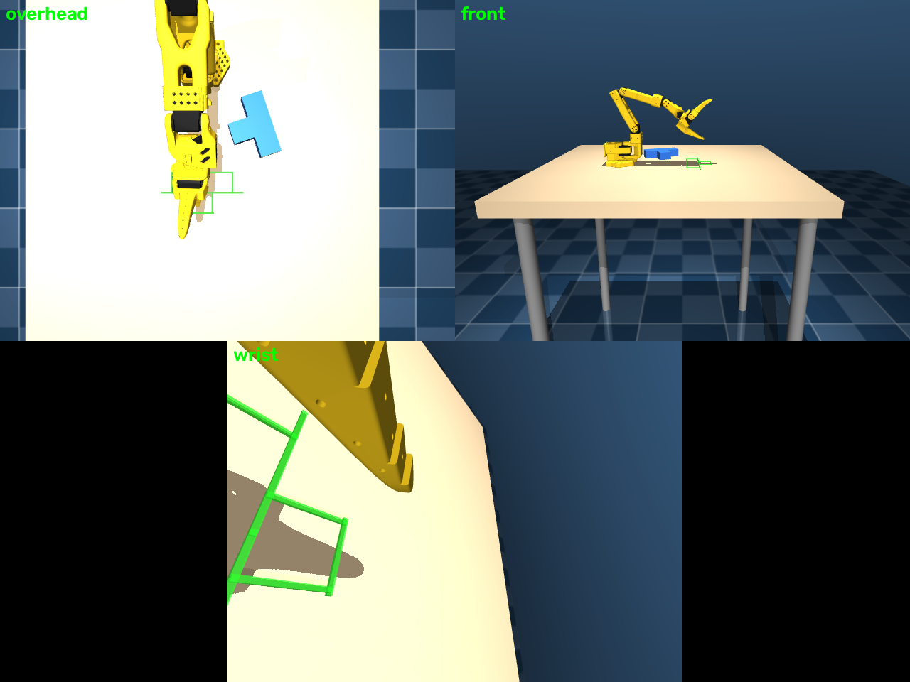

# MDP spec — Push-T (single arm, MuJoCo)

One SO-101 follower arm pushes a T-shaped block across the table onto a
green target T outline. **Non-prehensile**: the gripper is held closed
(pinned actuator target) and used as a pusher — no grasp reward or logic.

- Scene: arm at the standard base pose (`robots/so101/so101_follower.xml`,
  base at (0.18, 0, 0.82)); T-block (12 cm bar × 4 cm + 8 cm stem × 4 cm,
  2.5 cm thick, ~0.16 kg, two box geoms with auto-derived composite inertial)
  slides on the 0.82 m table; fixed target outline in front of the arm at
  world (0.45, 0) yaw 0.
- Control: 30 Hz position servos (16 physics steps of 2 ms per control step).
- Episode: 20 s = 600 steps → `truncated`.


*`overhead` (top-down over the workspace), `front` (front view), and `wrist`
(on the gripper). Every camera's pos/euler/fov is customizable via
`CameraConfig` fields in `env.py`, applied at init overriding the XML.*

## Observation space

Flat policy vector: 6+6+3+3+3+6 = **(27,)**.

| Field | Shape | Dtype | Description |
|---|---|---|---|
| `joint_pos` | (6,) | float32 | absolute joint positions, rad (`shoulder_pan, shoulder_lift, elbow_flex, wrist_flex, wrist_roll, gripper`) |
| `joint_vel` | (6,) | float32 | joint velocities, rad/s |
| `tcp_pos` | (3,) | float32 | gripper TCP (`gripperframe` site) world position, m |
| `t_pose` | (3,) | float32 | T-block pose in robot root frame: (x, y, yaw); z fixed — block slides on table |
| `target_pose` | (3,) | float32 | target pose in robot root frame: (x, y, yaw), fixed |
| `last_action` | (6,) | float32 | previous executed action (post-clip, gripper-pinned) |
| `images` | dict | uint8 | `{cam_name: (H, W, 3)}` RGB from every camera |

## Action space

`(6,)` float32 — **absolute** target joint positions in radians, clipped to
the actuator `ctrlrange`. The gripper channel is overridden with the constant
closed target (1.5 rad), so effectively 5 DoF are controllable. Position
servos (STS3215 model), 30 Hz.

## Reward terms

```
r = 1.0·exp(−d_xy²/(2σ_pos²)) + 0.5·exp(−(Δψ/σ_yaw)²)
    − 0.01·‖a_t − a_{t−1}‖² − 0.05 + 10·1[success]
```

| Term | Weight | Formula | Gating |
|---|---|---|---|
| pos kernel | ×1.0 | `exp(−d_xy² / (2·0.10²))`, `d_xy = ‖block_xy − target_xy‖` | — |
| yaw kernel | ×0.5 | `exp(−(Δψ / 60°)²)`, Δψ = wrapped yaw error | — |
| action rate | −0.01 | `‖a_t − a_{t−1}‖²` | — |
| alive | **−0.05**/step | dominant over action_rate → no stalling | — |
| success bonus | +10.0 | success condition below | once, on termination |

## Termination

| Path | Condition |
|---|---|
| `terminated` (success) | `d_xy < 0.025 m` AND `|Δψ| < 15°` |
| `truncated` (timeout) | 20 s episode (600 steps @ 30 Hz) |

## Reset / randomization

| What | Range | Mode |
|---|---|---|
| block XY spawn | uniform in an ~8 cm box centred at (0.36, 0.12) — beside the arm, clear of the home-pose gripper | reset |
| block yaw | uniform [0, 2π) | reset |
| arm | home qpos `(0, −0.5, 0.8, 0.4, 0, gripper=1.5)` | reset |

Target outline is fixed at (0.45, 0) yaw 0.

## Training

```bash
python -m rl.train --backend mujoco --task push_t --algo skrl --max-iterations 200
python -m rl.train --backend mujoco --task push_t --algo rsl_rl
```

Shared PPO hyperparameters (`rl/agents/`): actor/critic MLP `[256, 128, 64]`
ELU; rollouts 24; epochs 5; minibatches 4; lr 1e-3 adaptive (KL target 0.01);
γ 0.99; λ 0.95; clip 0.2; entropy 0.
